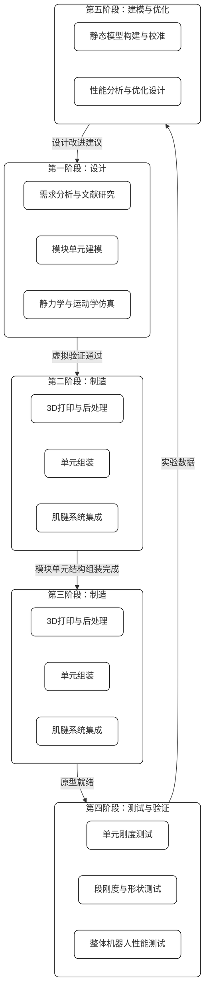

```mermaid
flowchart TD
    classDef roundedNode fill:#fff,stroke:#000,stroke-width:1px,rx:8px,ry:8px
    
    subgraph A[第一阶段：设计]
        A1[需求分析与文献研究]
        A2[模块单元建模]
        A3[静力学与运动学仿真]
    end

    subgraph B[第二阶段：制造]
        B1[3D打印与后处理]
        B2[单元组装]
        B3[肌腱系统集成]
    end

    subgraph E[第三阶段：制造]
        E1[3D打印与后处理]
        E2[单元组装]
        E3[肌腱系统集成]
    end

    subgraph C[第四阶段：测试与验证]
        C1[单元刚度测试]
        C2[段刚度与形状测试]
        C3[整体机器人性能测试]
    end

    subgraph D[第五阶段：建模与优化]
        D1[静态模型构建与校准]
        D2[性能分析与优化设计]
    end

    A -- 虚拟验证通过 --> B
    B -- 模块单元结构组装完成 --> E
    E -- 原型就绪 --> C
    C -- 实验数据 --> D
    D -- 设计改进建议 --> A

    class A,B,E,C,D,A1,A2,A3,B1,B2,B3,E1,E2,E3,C1,C2,C3,D1,D2 roundedNode
```