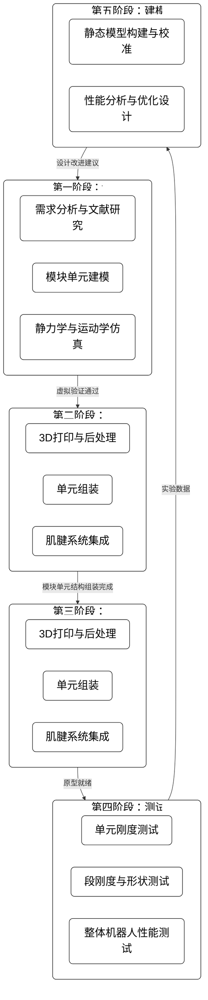

```mermaid
flowchart TD
    subgraph A[第一阶段：设计]
        A1[需求分析与文献研究]
        A2[模块单元建模]
        A3[静力学与运动学仿真]
    end

    subgraph B[第二阶段：制造]
        B1[3D打印与后处理]
        B2[单元组装]
        B3[肌腱系统集成]
    end

    subgraph E[第三阶段：制造]
        E1[3D打印与后处理]
        E2[单元组装]
        E3[肌腱系统集成]
    end

    subgraph C[第四阶段：测试与验证]
        C1[单元刚度测试]
        C2[段刚度与形状测试]
        C3[整体机器人性能测试]
    end

    subgraph D[第五阶段：建模与优化]
        D1[静态模型构建与校准]
        D2[性能分析与优化设计]
    end

    A -- 虚拟验证通过 --> B
    B -- 模块单元结构组装完成 --> E
    E -- 原型就绪 --> C
    C -- 实验数据 --> D
    D -- 设计改进建议 --> A

    style A fill:#fff,stroke:#000,stroke-width:1px,rx:8px,ry:8px,color:#000,font-size:22px
    style B fill:#fff,stroke:#000,stroke-width:1px,rx:8px,ry:8px,color:#000,font-size:24px
    style E fill:#fff,stroke:#000,stroke-width:1px,rx:8px,ry:8px,color:#000,font-size:24px
    style C fill:#fff,stroke:#000,stroke-width:1px,rx:8px,ry:8px,color:#000,font-size:24px
    style D fill:#fff,stroke:#000,stroke-width:1px,rx:8px,ry:8px,color:#000,font-size:24px
    style A1 fill:#fff,stroke:#000,stroke-width:1px,rx:8px,ry:8px,color:#000,font-size:24px
    style A2 fill:#fff,stroke:#000,stroke-width:1px,rx:8px,ry:8px,color:#000,font-size:24px
    style A3 fill:#fff,stroke:#000,stroke-width:1px,rx:8px,ry:8px,color:#000,font-size:24px
    style B1 fill:#fff,stroke:#000,stroke-width:1px,rx:8px,ry:8px,color:#000,font-size:24px
    style B2 fill:#fff,stroke:#000,stroke-width:1px,rx:8px,ry:8px,color:#000,font-size:24px
    style B3 fill:#fff,stroke:#000,stroke-width:1px,rx:8px,ry:8px,color:#000,font-size:24px
    style E1 fill:#fff,stroke:#000,stroke-width:1px,rx:8px,ry:8px,color:#000,font-size:24px
    style E2 fill:#fff,stroke:#000,stroke-width:1px,rx:8px,ry:8px,color:#000,font-size:24px
    style E3 fill:#fff,stroke:#000,stroke-width:1px,rx:8px,ry:8px,color:#000,font-size:24px
    style C1 fill:#fff,stroke:#000,stroke-width:1px,rx:8px,ry:8px,color:#000,font-size:24px
    style C2 fill:#fff,stroke:#000,stroke-width:1px,rx:8px,ry:8px,color:#000,font-size:24px
    style C3 fill:#fff,stroke:#000,stroke-width:1px,rx:8px,ry:8px,color:#000,font-size:24px
    style D1 fill:#fff,stroke:#000,stroke-width:1px,rx:8px,ry:8px,color:#000,font-size:24px
    style D2 fill:#fff,stroke:#000,stroke-width:1px,rx:8px,ry:8px,color:#000,font-size:24px
```